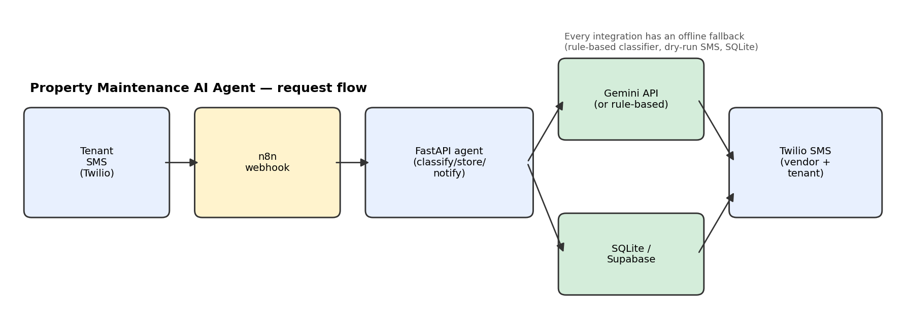
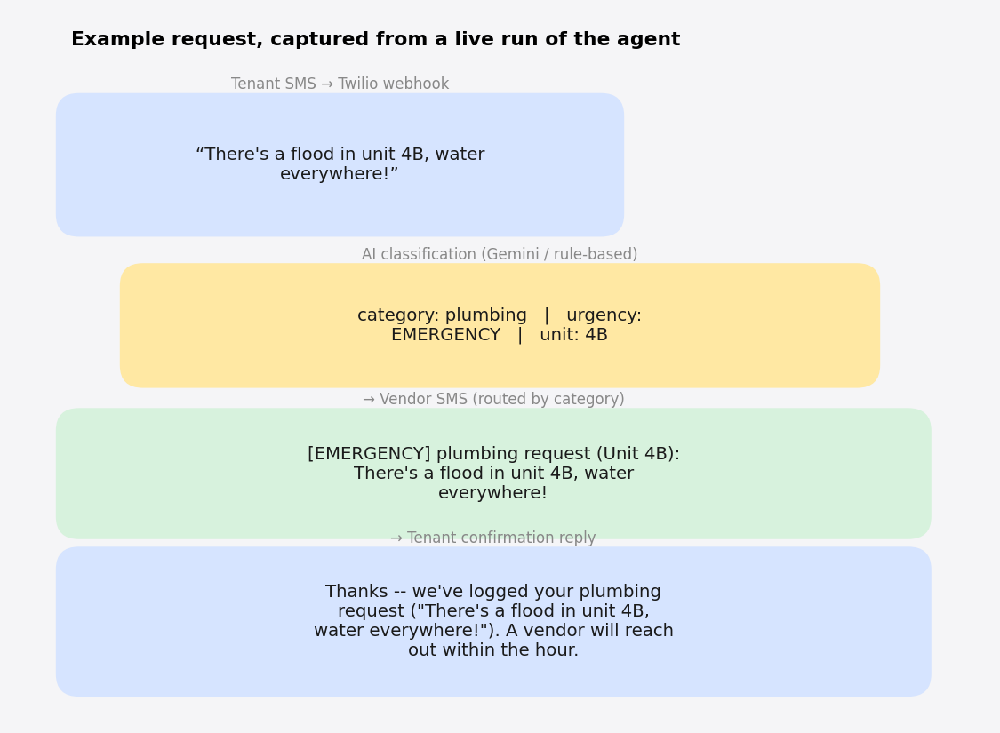
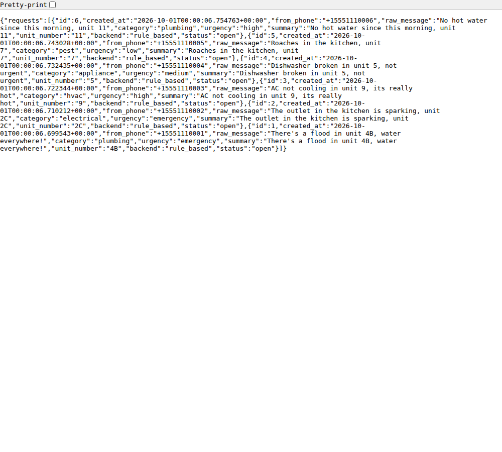
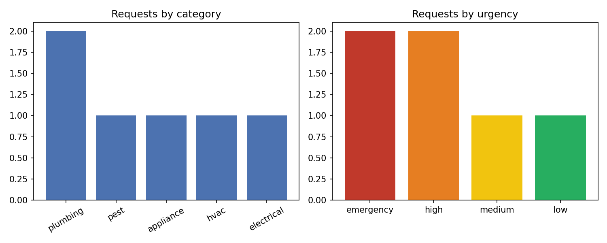

# Property Maintenance AI Agent

An AI-powered triage agent for tenant maintenance requests: a tenant texts a
problem, the agent classifies it (category + urgency), logs it, notifies the
right vendor, and replies to the tenant with an ETA — all via SMS, with an
n8n workflow handling the webhook orchestration and escalation branch.

## Architecture



<details>
<summary>Text version</summary>

```
Tenant SMS
   │
   ▼
Twilio (messaging webhook)
   │
   ▼
n8n workflow  ── webhooks/property_maintenance.json ──►  emergency? ──► call on-call manager
   │  (HTTP Request node)
   ▼
FastAPI agent (src/app.py)
   ├── classifier.py   -> Gemini API (or rule-based fallback): category + urgency + summary
   ├── storage.py      -> SQLite locally / Supabase-Postgres in production
   └── notifier.py     -> Twilio SMS to vendor + confirmation SMS back to tenant
   │
   ▼
TwiML reply  ──►  back through n8n  ──►  Twilio  ──►  Tenant
```
</details>

## Example run



n8n owns the public webhook entrypoint and the emergency phone-call
escalation branch (a visual, easy-to-edit rule non-engineers on a property
team could tweak); the Python service owns the actual classification,
persistence, and messaging logic so it's independently testable.

## Why it degrades gracefully

Every external integration is optional and has a safe fallback, so the
whole pipeline runs and is fully testable with **zero API keys**:

| Integration | With credentials | Without |
|---|---|---|
| Classification | Gemini API (`GEMINI_API_KEY`) | Deterministic keyword-based classifier |
| Vendor/tenant SMS | Twilio (`TWILIO_ACCOUNT_SID`/`TWILIO_AUTH_TOKEN`/`TWILIO_FROM_NUMBER`) | "Dry run" mode — logs the message that would be sent |
| Storage | Supabase/Postgres (swap `storage.py`'s connection) | SQLite file, same schema |

## Getting started

```bash
pip install -r requirements.txt

# Run the agent API
uvicorn src.app:app --reload --port 8000 --app-dir src

# Simulate an incoming tenant SMS (what Twilio would POST)
curl -X POST http://localhost:8000/webhooks/sms \
  -d "Body=There's a flood in unit 4B, water everywhere!" \
  -d "From=+15551234567"

# See everything logged so far
curl http://localhost:8000/requests
```



After a handful of simulated tenant texts, here's the real category/urgency
breakdown the agent produced:



To wire this up for real:
1. Deploy `src/app.py` somewhere reachable (Railway, Render, an n8n-hosted
   function, etc.).
2. Import `workflows/property_maintenance.json` into n8n and point its
   Webhook node's URL at your Twilio phone number's messaging webhook.
3. Copy `.env.example` to `.env` and fill in `GEMINI_API_KEY` and the
   Twilio credentials to switch on the live integrations.

## Tests

```bash
pytest tests/ -v
```

Covers: urgency/category classification across emergency, high, and
low-priority messages; unit-number extraction; SQLite persistence and
status updates; and dry-run notification behavior for both tenant and
vendor messages.

## Project structure

```
property-maintenance-agent/
├── src/
│   ├── app.py          # FastAPI webhook (Twilio SMS entrypoint)
│   ├── classifier.py   # Gemini-based (or rule-based) triage classifier
│   ├── storage.py      # SQLite persistence (Supabase-shaped schema)
│   └── notifier.py     # Twilio SMS to vendor + tenant, with dry-run fallback
├── workflows/
│   └── property_maintenance.json   # n8n workflow export
├── tests/
│   └── test_agent.py
├── .env.example
├── requirements.txt
└── README.md
```

## Tech stack

Python, FastAPI, n8n (workflow orchestration), Google Gemini API
(classification), Twilio (SMS + voice escalation), SQLite/Supabase
(persistence), pytest.

## Notes & limitations

- The rule-based classifier is a lightweight, dependency-free stand-in for
  the Gemini backend so the project is demoable without an API key; the
  keyword lists are intentionally simple and would benefit from expansion
  or a proper eval set in production.
- The vendor directory is hardcoded for the demo; in production it would be
  a per-property lookup table in the database.
- No real tenant, vendor, or property data is used anywhere in this repo.
